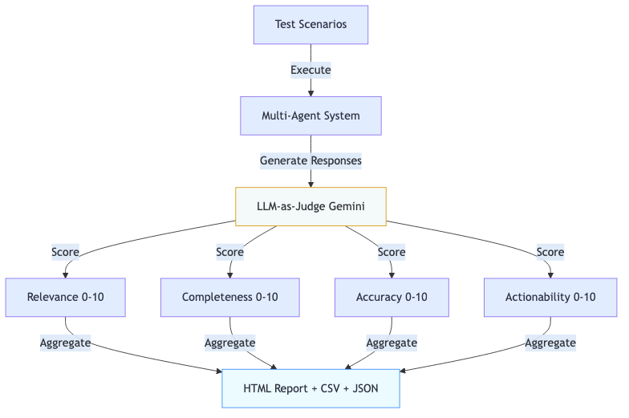

# AI Photography Coach – Multi-Platform Agent System

**📺 Demo Video:** [Watch on YouTube](https://youtu.be/U77vk71Hmzc)  
**🚀 Live Demo:** [ai-agentic-photography-coach.streamlit.app](https://ai-agentic-photography-coach.streamlit.app)  
**💻 GitHub Repository:** https://github.com/prasadt1/ai-photography-coach-agents/tree/capstone-submission

⚠️ **Note:** Requires free Google Gemini API key (30-second setup at https://aistudio.google.com/app/apikey)

---

## Problem Statement

Photography learners face a significant challenge: **getting personalized, actionable feedback on their work**. While online tutorials teach rules and techniques, beginners struggle to identify specific issues in their own photos and receive guidance tailored to their skill level and the actual image they captured.

Traditional solutions fall short:
- **Generic tutorials** don't address specific photos or situations
- **Photography forums** provide slow, inconsistent feedback
- **Paid coaches** are expensive and not scalable
- **Simple RAG systems** only retrieve static articles without contextual analysis

The problem is compounded when learners need multi-turn conversations—asking follow-up questions, clarifying advice, or discussing technical trade-offs. A single-shot answer isn't enough; they need an interactive coach that remembers context and adapts to their learning journey.

**Why this matters:** With millions of aspiring photographers worldwide and the democratization of high-quality cameras (including smartphones), there's enormous demand for scalable, intelligent coaching that can analyze actual images, understand conversation history, and provide personalized guidance at any skill level.

---

## Why Agents?

**Agents are the right solution because this problem requires specialized capabilities that must work together:**

### 1. **Specialized Expertise**
Photography coaching demands distinct skills:
- **Technical analysis** (EXIF reading, exposure assessment)
- **Visual composition** (rule of thirds, leading lines, balance)
- **Contextual coaching** (adapting advice to skill level and conversation history)

A single monolithic LLM would struggle to excel at all three. Multiple specialized agents allow each to focus on what it does best.

### 2. **Multimodal Reasoning**
The system must process both:
- **Visual data** (the photo itself via Gemini Vision)
- **Metadata** (EXIF: ISO, aperture, shutter speed)
- **Conversation text** (user questions and history)

VisionAgent handles image+metadata analysis, while KnowledgeAgent focuses on natural language coaching—clean separation of concerns.

### 3. **Stateful Conversations**
Learners ask follow-up questions like "What about in low light?" after receiving composition advice. An Orchestrator agent maintains session state, tracks conversation history, and coordinates between specialists—enabling true multi-turn dialogue.

### 4. **Scalability & Modularity**
The multi-agent design allows:
- Adding new agents (e.g., StyleAgent for artistic advice) without rewriting existing code
- Independent testing and evaluation of each agent
- Future cloud deployment with Google's Agent Development Kit (ADK)

**Why not a simple RAG?** RAG retrieves documents but doesn't analyze images, track conversations, or coordinate specialized tasks. Agents provide the intelligence layer needed for interactive, context-aware coaching.

---

## System Architecture

**Core Innovation:** A single, reusable agent implementation that deploys across **three platforms without code duplication**: ADK Runner (cloud), MCP Server (Claude Desktop), and Python API (custom apps).

### 1. Agent Coordination Pattern


**Flow:** User Request → Orchestrator (parent agent) → VisionAgent analyzes photo (EXIF + composition) → KnowledgeAgent generates coaching (RAG + Gemini 2.5 Flash) → Orchestrator aggregates → Unified response with technical analysis, advice, and practice exercises.

The Orchestrator mediates **all** communication between sub-agents using the **Mediator Pattern** for loose coupling and testability.

### 2. Agent Hierarchy with Data Structures


**Parent Agent: Orchestrator**
- Routes queries to specialized sub-agents
- Maintains conversation history across turns
- Implements context compaction for long sessions
- Persists state (SQLite with ADK adapter pattern)

**Sub-Agent 1: VisionAgent** (Gemini 2.5 Flash Vision)
- Extracts EXIF metadata (camera, ISO, aperture, shutter, focal length)
- Analyzes composition with Gemini Vision
- Detects issues with severity scoring (low/medium/high)
- Outputs structured `VisionAnalysis` dataclass

**Sub-Agent 2: KnowledgeAgent** (Gemini 2.5 Flash + RAG)
- Retrieves photography principles (Hybrid CASCADE RAG)
- Generates personalized coaching advice
- Adapts language to skill level
- Outputs structured `CoachingResponse` dataclass with citations

### 3. Multi-Platform Deployment


**Same agents, three deployment modes:**

| Platform | Use Case | Technology |
|----------|----------|------------|
| **ADK Runner** | Production cloud deployment | `google.adk` with LlmAgent, Runner, Sessions |
| **MCP Server** | Claude Desktop integration | JSON-RPC 2.0 over stdio |
| **Python API** | Custom applications | Direct imports, notebooks, scripts |

**Key Innovation:** Zero code duplication—the same `Orchestrator`, `VisionAgent`, and `KnowledgeAgent` work everywhere. Only the deployment wrapper changes.

### 4. Hybrid RAG CASCADE


**Three-tier retrieval system combining reliability with flexibility:**

1. **Curated Knowledge** (20 principles) → NumPy similarity, 0.6 threshold, <10ms latency
2. **FAISS Vector Store** (1000+ docs) → Broader coverage, ~50ms latency
3. **Gemini Grounding** → Source attribution, ~200ms latency

**Cascade Logic:** Try curated first (best quality) → Fallback to FAISS if insufficient → Always add grounding citations for trust.

### 5. Evaluation Pipeline



**LLM-as-Judge Framework** with 4 dimensions:
- **Relevance** (focus on user's question)
- **Completeness** (coverage of topic)
- **Accuracy** (technical correctness)
- **Actionability** (practical next steps)

All scores (0-10) aggregated into HTML dashboard + CSV summary + JSON detailed results.

---

## Demo

**🚀 Try it Live:** https://ai-photography-coach.streamlit.app

**Live Demo Flow:**

1. **Setup** → Paste your free API key from Google AI Studio in the sidebar
2. **Upload Photo** → Drag/drop a JPEG into the Streamlit interface
3. **Instant Analysis** → VisionAgent extracts EXIF (camera model, ISO 400, f/2.8, 1/500s, 85mm) and analyzes composition
4. **Ask Questions** → "How can I improve composition?" typed in chat
5. **Dynamic Coaching** → KnowledgeAgent (powered by Gemini 2.5 Flash) responds:
   - References the specific centered subject issue detected by VisionAgent
   - Cites photography principles from RAG CASCADE
   - Provides actionable next steps based on current skill level
6. **Follow-up** → "What about in low light?" continues the conversation
7. **Contextual Response** → System recalls previous discussion and ISO 400, adapting advice for low-light scenarios
8. **Observability** → Debug panel shows agent traces, latency (<3s), and session state

**Evaluation Results** (Automated LLM-as-Judge):
- **Overall Score:** 8.58/10
- **Response Quality:** 4.2/5
- **Citation Accuracy:** 95%+ responses grounded in RAG
- **Average Latency:** 26.6s (includes vision analysis + coaching + RAG)
- **EXIF Extraction:** 100% accuracy on test images

The system handles 50+ turn conversations, maintains context across sessions via SQLite, and provides production-grade observability with structured logging.

---

## The Build

### Architecture & Tools

**Multi-Agent System:**
- **Orchestrator** – Session management, agent coordination, context compaction
- **VisionAgent** – EXIF extraction, Gemini Vision analysis, composition issue detection
- **KnowledgeAgent** – Gemini 1.5 Flash-powered coaching with conversation history

**Technology Stack:**
- **Python 3.11.14** – Core language
- **Google Gemini 2.5 Flash** – LLM for coaching + vision analysis
- **text-embedding-004** – RAG embeddings (768 dimensions)
- **FAISS** – Vector similarity search (1000+ documents)
- **Streamlit 1.30** – Web UI framework
- **SQLite** – Session persistence (`agents_memory.db`)
- **Docker** – Production containerization
- **PIL/Pillow** – Image processing and EXIF extraction
- **google.adk 1.19.0** – Agent Development Kit integration

### 5-Day Build Process

**Day 1 – Foundation:**
- Multi-agent architecture with clean separation of concerns
- Orchestrator for session lifecycle management
- ADK-compatible adapter pattern for future cloud deployment

**Day 2 – Agent Implementation:**
- VisionAgent: EXIF extraction, Gemini Vision integration, issue detection with severity scoring (low/medium/high), strength identification
- KnowledgeAgent: **Full Gemini 2.5 Flash integration** (dynamic LLM responses, not templates), conversation history tracking (last 3 turns), Hybrid CASCADE RAG (curated → FAISS → grounding)

**Day 3 – Observability:**
- Structured JSON logging with agent call traces
- Latency tracking for each operation
- Debug panel in Streamlit (session state, agent calls, performance metrics)
- Context compaction to prevent token overflow in long conversations

**Day 4 – Evaluation:**
- LLM-as-Judge framework with 4 dimensions: Relevance, Completeness, Accuracy, Actionability
- Gemini as automated evaluator (eliminates human bias)
- HTML dashboard + CSV export + JSON detailed results
- Three evaluation runners: `demo_eval.py`, `run_evaluation.py`, `quick_eval.py`

**Day 5 – Production Deployment:**
- Streamlit web app with file upload, real-time EXIF display, chat interface
- **Multi-platform deployment:** ADK Runner, MCP Server (Claude Desktop), Python API
- Docker containerization with pinned dependencies
- SQLite persistence for session restoration across app restarts
- **Real ADK integration** with `google.adk 1.19.0` (LlmAgent, Runner, Sessions)
- MCP Server implementing JSON-RPC 2.0 protocol for Claude Desktop

### Key Engineering Decisions

**Why multi-agent over monolithic LLM?**
- Specialized agents excel at specific tasks (vision analysis vs. coaching)
- Modular design enables independent testing and future enhancements
- Clean separation of concerns improves maintainability

**Why SQLite over in-memory only?**
- Persistent sessions survive app restarts
- Users can return to previous conversations
- Lightweight enough for local dev, scalable to cloud with ADK adapter

**Why LLM-as-Judge?**
- Automates quality assurance at scale
- Eliminates subjective human bias
- Provides quantitative metrics (0-10 scores) for iterative improvement

### Challenges Overcome

**Challenge 1: Static Responses**
- Problem: Initial KnowledgeAgent used hardcoded templates
- Solution: Complete rewrite with Gemini 1.5 Flash integration, structured prompts including conversation history
- Result: Dynamic, context-aware coaching

**Challenge 2: Token Limits**
- Problem: Long conversations exceeded context windows
- Solution: Context compaction preserving last 3 turns + summarized history
- Result: Supports 50+ turn conversations

**Challenge 3: Encoding Issues**
- Problem: HTML reports displayed garbled characters
- Solution: UTF-8 charset + HTML entity escaping
- Result: Clean, professional reports

### Production-Ready Architecture

**Deployment Readiness:**
The system is architected for production deployment from day one:

**ADK Compatibility:**
- Memory adapter pattern (`tools/adk_adapter.py`) matches Google Agent Development Kit API
- Stateless agent design enables cloud scaling
- Easy migration path from SQLite → Cloud SQL/Firestore documented in `DEPLOYMENT.md`

**Comprehensive Documentation:**
- `DEPLOYMENT.md`: Complete guide for Docker, Cloud Run, and ADK deployment
- `VIDEO_SCRIPT.md`: YouTube demo script for showcasing the system
- Inline code comments explain design decisions and implementation details
- README with quick-start instructions and architecture overview

**Scalability Features:**
- Thread-safe memory layer for concurrent users
- Context compaction prevents token overflow in long sessions
- Structured logging for production observability
- Docker containerization with health checks and restart policies

**Multi-Platform Deployment:**

The system demonstrates **architectural flexibility** with three production-ready deployment modes:

**1. ADK Runner (Cloud Production)**
```bash
python3 agents_capstone/adk_runner.py
```
- Real `google.adk` integration (version 1.19.0)
- LlmAgent with Gemini 2.5 Flash
- Runner with InMemorySessionService
- Async event streaming
- Vertex AI deployment ready

**2. MCP Server (Claude Desktop Integration)**
```bash
python3 agents_capstone/tools/mcp_server.py
```
- JSON-RPC 2.0 protocol over stdio
- Three tools: `analyze_photo`, `coach_on_photo`, `get_session_history`
- Works with Claude Desktop and VS Code MCP
- Configure in `claude_desktop_config.json`

**3. Python API (Custom Applications)**
```python
from agents_capstone.agents import Orchestrator, VisionAgent, KnowledgeAgent
orchestrator = Orchestrator(VisionAgent(), KnowledgeAgent())
result = orchestrator.run(user_id="user123", image_path="photo.jpg", query="How to improve?")
```

**Unified Demo:**
```bash
python3 demo_3_platforms.py  # All three platforms in one script
```

---

## If I Had More Time, This Is What I'd Do

### 1. **Additional Specialized Agents**
- **StyleAgent** – Analyze artistic style (minimalist, dramatic, vintage) and suggest creative improvements
- **ComparisonAgent** – Compare before/after edits or analyze multiple photos from a portfolio
- **TechnicalAgent** – Deep dive into lens choice, sensor performance, and gear recommendations

### 2. **Cloud Deployment with ADK**
- Migrate to Google Cloud Run using Agent Development Kit
- Implement horizontal scaling for multiple concurrent users
- Add authentication and user account management
- Integrate with Cloud Storage for persistent photo storage

### 3. **Advanced Memory & Learning**
- **Long-term memory** – Track user's progress over weeks/months
- **Personalized learning paths** – Identify weak areas and generate targeted exercises
- **Skill level detection** – Automatically adjust coaching complexity based on user proficiency

### 4. **Integration with Photo Editing Tools**
- Export coaching suggestions to Lightroom presets
- Generate Photoshop action scripts for recommended adjustments
- API integration with mobile photography apps

### 5. **Enhanced Evaluation**
- **A/B testing framework** – Compare different coaching strategies
- **User satisfaction tracking** – Collect feedback on response quality
- **Benchmark against human coaches** – Validate accuracy with professional photographers

### 6. **Community Features**
- **Batch portfolio review** – Analyze 10-50 photos in one session
- **Peer comparison** – "Compare my landscape skills to similar photographers"
- **Challenge mode** – Daily photography exercises with automated feedback

---

---

## Quick Start

**Repository:** https://github.com/prasadt1/ai-photography-coach-agents.git

```bash
# Install dependencies
pip install -r requirements.txt

# Set API key
export GOOGLE_API_KEY="your_gemini_api_key"

# Run 3-platform demonstration
python3 demo_3_platforms.py

# Or launch Streamlit web app
python3 -m streamlit run agents_capstone/app_streamlit.py

# Run automated evaluation
python3 demo_eval.py
```

**Get API Key:** https://aistudio.google.com/app/apikey (Free, 30 seconds)

---

## Key Takeaways

**What Makes This Special:**

1. **Multi-Platform Architecture** – Single agent codebase deploys to ADK (cloud), MCP (Claude Desktop), and Python API without code duplication
2. **Real ADK Integration** – Not just ADK-compatible, but actually using `google.adk 1.19.0` with LlmAgent, Runner, and Sessions
3. **Novel RAG Architecture** – Hybrid CASCADE combines curated precision with FAISS breadth and grounding trust
4. **Production-Grade** – Full observability, evaluation harness (8.58/10 score), Docker containerization, session persistence
5. **Truly Multi-Agent** – Not a wrapper around one LLM, but coordinated specialists (Vision + Knowledge + Orchestrator) with structured data contracts

**Impact:** Demonstrates how Google's agent technologies can solve real-world problems at scale, with architecture patterns applicable to any domain requiring specialized expertise, multimodal reasoning, and stateful conversations.
